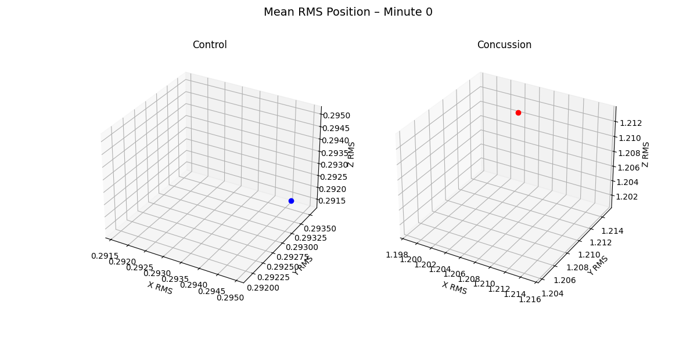
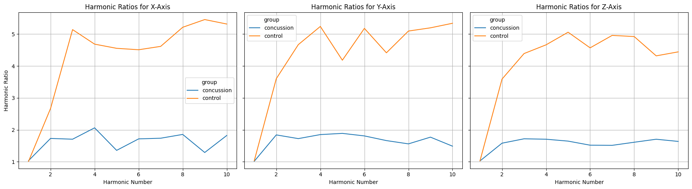
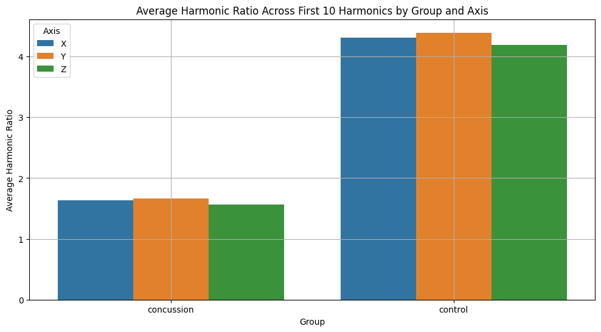
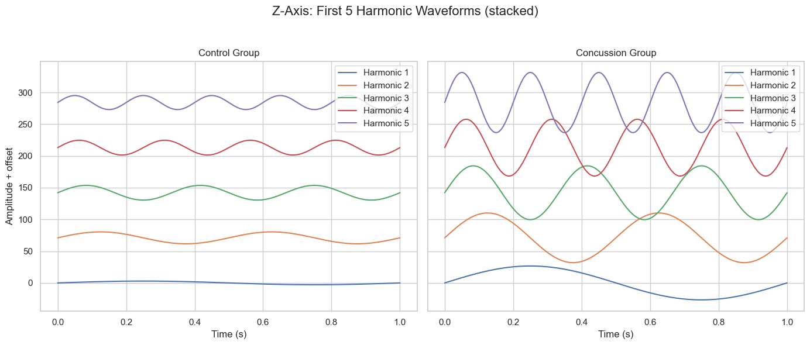

# Harmonic Ratio Gait Analysis Using Synthetic Tri-Axial Accelerometry Data

## Scope

This project demonstrates the development of a modular Python package for quantifying **gait rythmicity** using **harmonic ratios** derived from wearable accelerometry data. It includes signal preprocessing, RMS extraction, harmonic decomposition, group comparisons (e.g., concussion vs. control), and animated visualizations of movement and waveform features. ***n.b.*** This project is based on real clinical data, but the data presented and used here are synthetic but structurally representative of real clinical accelerometer files (which remain unpublished).

## Clinical Context

A full background to this project can be found on my portfolio <https://bsharma.super.site/projects-database/harmonic-ratio>. 

In short, exercise has become part of clinical management for concussion. Yet we do not know if there are gait differences after concussion during exercise. We collected (and present a synthetic version of) tri-axial accelerometer data acquired during a standardized treadmill test, to assess group-wise differences in harmonic ratios (a measure of gait rhythmicity), per axis. 

From these raw acceleration signals, we can compute:

- **RMS values**: measure general signal magnitude over time
- **Harmonic ratios (HR)**: assess the symmetry and periodicity of walking patterns

The harmonic ratios are particularly relevant for assessing how "smooth" or "rhythmic" gait is post-injury. These data are captured through frequency-based signal decomposition.

## Analysis Goals

This project explores:

- How gait waveform harmonics differ between **concussion** and **control** groups
- Whether **harmonic ratios** and **RMS motion** diverge across groups
- How we can visualize these changes through **animated motion plots**

All visualizations and metrics are designed to be interpretable and reproducible, using only time-domain signals and Fourier-transformed outputs.

## Visual Outputs

This package generates a series of visuals:

- **3D RMS Animation**: groupwise motion paths over time  
- **Sinusoidal Decomposition**: waveform animations of harmonic components  
- **Group Comparison Plots**: harmonic ratio differences by axis and group  

## Data

- `synthetic_data/`: synthetic accelerometer `.csv` files  
  Each file includes raw triaxial acceleration at 30 Hz with timestamps.

## Package Features

- Modular design with `rms.py`, `harmonics.py`, and `filters.py`
- Bandpass filtering and RMS windowing
- Harmonic decomposition via Fourier transforms
- Animated and static plots (saved as `.gif`)
- Fully tested with `pytest` and continuous integration via GitHub Actions

## How to Use

### Step 1: Install dependencies

```bash
pip install git+https://github.com/bsharma0806/concussion_harmonicRatio.git
```

### Step 2: Clone repo

```bash
git clone https://github.com/bsharma0806/concussion_harmonicRatio.git
cd concussion_harmonicRatio
pip install -e .
```

### Example usage

```python
from harmonic_ratio.rms import process_rms_folder
from harmonic_ratio.harmonics import plot_harmonic_waveforms
from harmonic_ratio.filters import bandpass_filter
```

### Example outputs









## Notes
Built as part of a data science portfolio (with an accompanying blod post available here: https://bsharma.super.site/projects-database/harmonic-ratio), with the publication using the original clinical data pending. Real clinical data was replaced by synthetic equivalents.